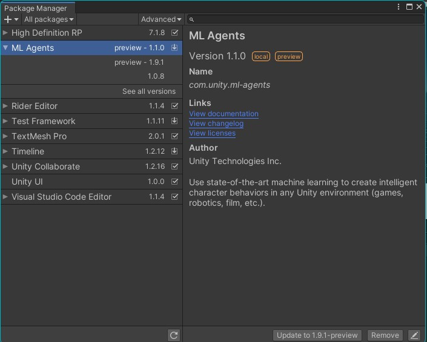

[](https://creativecommons.org/licenses/by-sa/4.0/)
[](https://www.gnu.org/licenses/gpl-3.0)
[](http://makeapullrequest.com)

[Unity + ML-Agent Introduction Video:  ](https://www.youtube.com/watch?v=NgxK7SK8qnA)

[](https://www.youtube.com/watch?v=NgxK7SK8qnA)

1. install unity 2019.3.3f1 and unity hub 2.3.2 (note: do not update at all.)
[download Unity from here](https://jetamooz.com/courses/unity-pro-2019/)

2. add project to unity hub by path (under 260 character)

3. install blender 2.80 (optional)

4. use VPN for resolving package
  
5. import sofa asset

6. at the path {project path}/Package/manifest.json
in line 5:
"com.unity.ml-agents": "file:../../com.unity.ml-agents",

    6.1. use com.unity.ml-agents_1.1.0  for com.unity.ml-agents
    [download ML Agent from here](https://github.com/Unity-Technologies/ml-agents/tree/com.unity.ml-agents_1.1.0)
    6.2 chack the version form Assets tab -> View in Package Manager -> ML Agents

    

7. install anaconda with python
    ```{r, engine='bash', count_lines}
    	conda create --name py37 python=3.7 anaconda 
    ```

8. install pytorch
    ```{r, engine='bash', count_lines}
        pip3 install torch==1.7.1+cpu -f [https://download.pytorch.org/whl/torch_stable.html]
    ```

9. install mlagents
    ```{r, engine='bash', count_lines}
        python -m pip install mlagents==0.26.0
    ```
    use [this repository](https://github.com/Unity-Technologies/ml-agents/tree/main/ml-agents)
    (in failure case: pip install versioned-hdf5)

10. install vscode
Learn more: [How To Make Intellisense Work In VSCode With Unity?](https://www.youtube.com/watch?v=btga03_gGfw)

11. versioning:
[more info](https://www.youtube.com/playlist?list=PL8fePt58xRPY1-pkhMPus3GlUGXNdqMH5)

    11.1. version in python env:
    ```{r, engine='bash', count_lines}
    $ conda list
    ```
    | package          | version |        |      |
    |------------------|---------|--------|------|
    | mlagents         | 0.16.0  | pypi_0 | pypi |
    | mlagents-envs    | 0.16.0  | pypi_0 | pypi |
    | Communicator API | 1.0.0   |        |      |
    | TensorFlow       | 2.5.0   |        |      |

    11.2. version in unity env:
    [https://github.com/Unity-Technologies/ml-agents/releases/tag/release_17]([https://github.com/Unity-Technologies/ml-agents/releases/tag/release_17])

    | package          | version |
    |------------------|---------|
    | mlagents         | 1.0.0-preview  |
    | communication    |1.0.0  | pypi_0 |

-----------------

12. install CUDA and cudnn library for GPU
[How to use Machine Learning AI in Unity!](https://www.youtube.com/watch?v=zPFU30tbyKs)


13. clone this library:
[VirtualCapsuleEndoscopy](https://github.com/CapsuleEndoscope/VirtualCapsuleEndoscopy)

14. Copy the folder "com.unity.ml-agents" from the ml-agent library to root folder of your project
15.
    ```{r, engine='bash', count_lines}
    mlagents-learn config\trainer_config.yaml --run-id=stable --train --force
    ```
